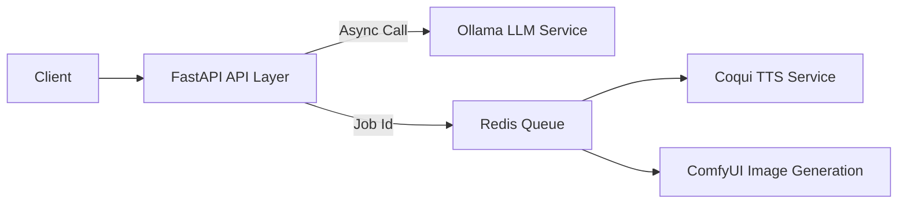

## Generative AI Template

##### Production-Ready Local Multimodal AI Backend (LLM + TTS + Image)

`A fully self-hosted, production-grade Generative AI backend template powered by local models.
Built with FastAPI, Redis, ARQ and Docker — designed for scalable, asynchronous AI workloads.`

#### What this Project Is?

**Generative AI Template** is a modular backend framework for building multimodal AI applications.
It provides:

- Text generation (LLM via Ollama)
- Image generation (ComfyUI)
- Text-to-Speech (Coqui TTS)
- Async job queue with Redis + ARQ
- Batch processing support for Image
- Fully containerized setup

The template is purposefully kept (100% Free) opensource dependent, so premium api can be plugged anytime without any issues.

This repo is designed to be:

- A production-ready starter template
- A foundation for SaaS AI systems

## Architecture Overview

## Why this architecture?

- Non-blocking API
- Scalable job workers
- Clean service abstractions
- Isolating services
- Easy horizontal scaling

## Generated Sample

Here is a image generated via ComfyUI of my cup, 

