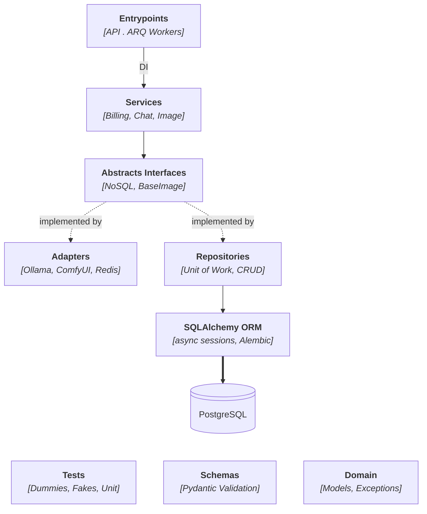

# Containerized Generative AI API Template

> A production-ready FastAPI backend template for LLM, image generation, and TTS — built with architecture that scales, not just code that runs.

---

## Why This Exists

Most GenAI backend tutorials get you to a working demo. Then you hit production and realize you need auth, job queuing, billing, database migrations, and service abstractions that don't collapse when you swap one AI provider for another.

This template gives you that foundation. The AI integrations (Ollama, ComfyUI, Coqui TTS) are real and working — but they're just services. The architecture is the point.

---

## Sample Output

This mug was fed into one of the ComfyUI workflows, interpolated, and composited into a generated background — entirely through the API.

with a simple prompt: `take the subject. put it on a mountain cliff. Where in the far sight we can sea the vast ocean.`

<details>

<summary> Input and the generated ouput Image</summary>

|                           Before                            |                            After                            |
| :---------------------------------------------------------: | :---------------------------------------------------------: |
|  |  |

</details>

## Design & Architecture

Follows **Onion Architecture** with pythonic Domain Driven Design. Every dependency points inward — adapters and repositories both implement abstract interfaces, so services never know what's on the other side.



**What this buys you:** swap Ollama for any other LLM either custom or **Third party API integrations** by implementing `BaseLLM`. Replace ComfyUI with diffusers by implementing `BaseImageGenerator`. Services stay untouched.

Image generation runs asynchronously — the API enqueues a job via ARQ, a worker processes it, and the result is stored in Redis. The client polls for status.

```
POST /api/diffusion/* → ARQ enqueues job → worker processes → Redis stores result
                                                        ↑
                               GET /api/diffusion/get-status/{job_id}
```

---

## Tech Stack

| Layer                | Technology              |
| -------------------- | ----------------------- |
| **API Framework**    | FastAPI (async)         |
| **Database**         | PostgreSQL + Alembic    |
| **Cache / Queue**    | Redis + ARQ             |
| **Testing**          | pytest + mock fixtures  |
| **Data Validation**  | Pydantic                |
| **LLM**              | Ollama                  |
| **Image Generation** | ComfyUI                 |
| **Text-to-Speech**   | Coqui TTS               |
| **Deployment**       | Docker + Docker Compose |

---

## API Endpoints

```
# AI
POST /api/llm/generate                    Text generation
POST /api/diffusion/*                     Image generation (async)
GET  /api/diffusion/get-status/{job_id}   Poll job status

# Auth
POST /api/auth/login
POST /api/auth/logout
POST /api/auth/refresh

# CRUD
POST /api/db/create-user
POST /api/db/create-product
...
```

Full interactive docs at `http://localhost:8000/docs` once running.

---

## Project Structure

```
app/
├── domain/          # Models and exceptions — no dependencies
├── interfaces/      # Abstract base classes for all services
├── services/        # Business logic — depends only on interfaces
├── adapters/        # AI integrations: Ollama, ComfyUI, Redis
├── repositories/    # DB layer: Unit of Work + CRUD
├── entrypoints/     # FastAPI routes and ARQ workers
└── schemas/         # Pydantic I/O validation
```

The domain sits at the center. Everything else points toward it, nothing leaks outward.

---

## Running Tests

Unit tests use in-memory fakes and dummies — no real services or database needed.

I have managed to write **87** unit tests covering services, adapters, and repositories.

```bash
pytest . -m ""
```

---

## Quick Start

If you just want it running, this gets you there in under two minutes.

**1. Copy and configure the env file**

```bash
cp .env.example .env
```

**2. Start with Docker Compose**

```bash
make dummy-watch
```

**3. Open the docs**

```
http://localhost:8000/docs
```

**4. Seed dummy data**

Hit the `/api/admin/setup-dummy-data` endpoint. This creates a test user:

```
email:    user@example.com
password: password123
```

**5. Login before hitting protected endpoints** — the `/api/auth/login` route returns your token.

---

## Contributing

PRs are welcome. For anything beyond a small fix, open an issue first so we're aligned before you invest the time.

---

## License

[MIT](LICENSE)
